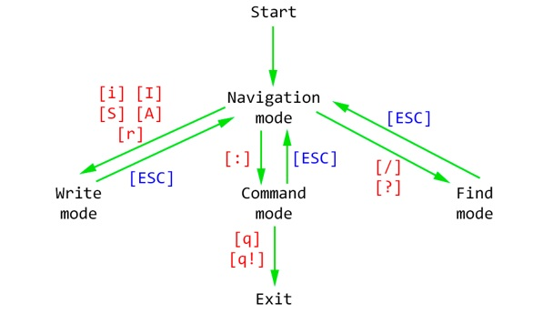

# ConsoleEditor
Text console editor with ncurses

## Install
- This project was creative on Windows
- On Linux ncurses can be installed with `sudo apt-get install libncurses5-dev libncursesw5-dev` (Do no forget to change "curses.h" to <curses.h> in headers)
- On Windows you should connect curses.h and pdcurses.lib in project propirties

## Functions


### Table 1 — Change mode buttons
```
i	Enter text before the cursor.
I	Go to the beginning of the line and start entering text.
S	Go to the end of the line and start typing.
A	Delete the contents of the row and start typing.
r	Replace one character under the cursor.
:	Activating the command input mode.
/	Activates search mode until the end of the document.
?	Activates search mode until the start of the document.
ESC Escape from mode
```
### Table 2 — Navigation buttons
```
RIGHT	Moves the cursor one position to the right if it is the end of the line moves to the first position of the next line.
LEFT	Moves the cursor one position to the left if this is the beginning of the line moves to the end of the previous line.
UP	Moves the cursor up one position (if next line shorter, then moves to the end of this line) if this is the beginning of the screen doing a scroll.
DOWN	Moves the cursor one position (if next line shorter, then moves to the end of this line) down if it is the end of the screen doing a scroll.
PAGE_UP	Raises the cursor one page.
PAGE_DOWN	Moves the cursor down one page.
g	Moves the cursor to the first page of the text.
G	Moves the cursor to the last page of the text.
```

### Table 3 — Navigation command buttons
```
^	Moves the cursor to the start of the line.
$	Moves the cursor to the end of the line.
w	Move the cursor to the end of a word to the right of the cursor (if the cursor is at the end of a word, then move the cursor to the end of the next word).
b	Move the cursor to the beginning of the word to the left of the cursor (if the cursor is at the beginning of the word, then move the cursor to the beginning of the previous word).
x	Delete the character after the cursor.
diw	Delete the word under the cursor, including one space on the right.
dd	Cut (copy and delete) the current line.
y	Copy the current line.
yw	Copy the word under the cursor.
p	Insert after the cursor.
NG	Go to the line with the number N.
```

### Table 4 — Find commands and buttons
```
/ <text>	Search for the <text> string from the cursor to the end of the file. If a line is found, move the cursor to the beginning of the line.
? <text>	Search for the <text> string from the cursor to the beginning of the file. If a line is found, move the cursor to the beginning of the line.
n	Repeat search forward.
N	Repeat search back.
```

### Table 5 — Find commands and buttons
```
o <filename>	Open the file <filename>.
x	Write to the current file and close it.
w	Write to the current file.
w <filename>	Write to file <filename>.
q	Exit program.
q!	Exit program without saving current file.
wq!	Write to the current file and close it.
num	Go to the line with the number <num>.
h	Program help.
```
